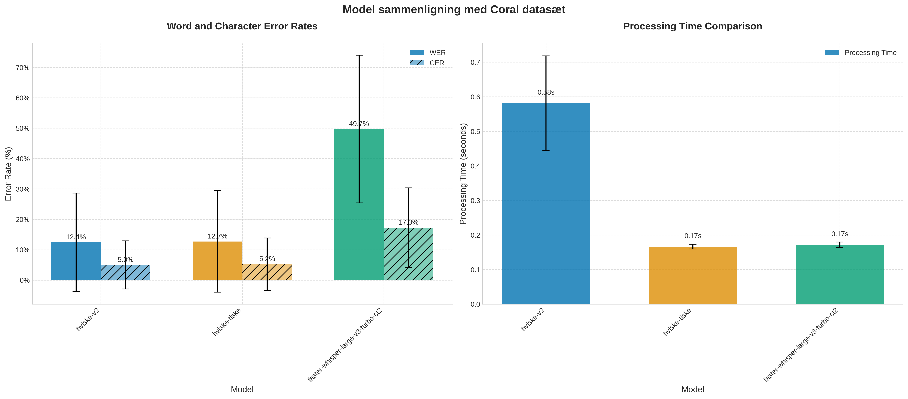
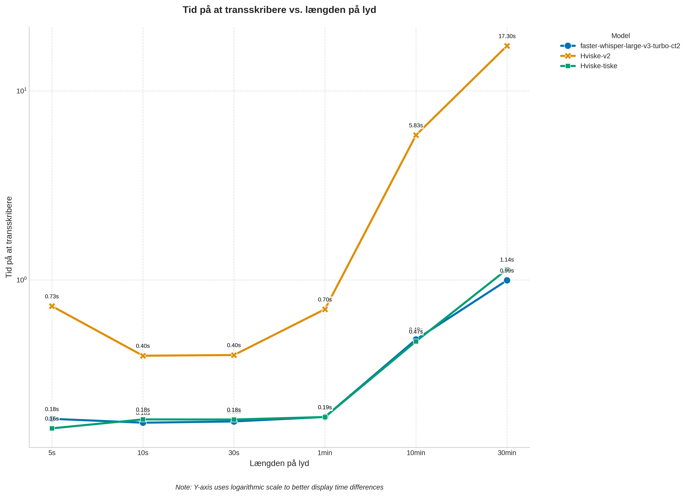

# Hvisketiske

Hviske-tiske er, så vidt jeg ved, den hurtigste (og "næsten" bedste) danske open-source ASR model. 
Modellen er distilleret ned fra syvai's hviske-v2. 

Repoet her indeholder koden der er brugt til at distillere modellen ned til CT2 format, så den kan køres med bl.a. faster-whisper

## Example

Modellen kan i alt sin enkelthed køres med nedenstående:
```python
from faster_whisper import WhisperModel

model = WhisperModel("pluttodk/hviske-tiske")

segments, info = model.transcribe("audio.mp3")
for segment in segments:
    print("[%.2fs -> %.2fs] %s" % (segment.start, segment.end, segment.text))
```

### Performance



| model     | wer (mean) | wer (std)  | cer (mean) | cer (std)  | time (mean) | time (std)  |
|-----------|------------|------------|------------|------------|-------------|-------------|
| hviske-v2     | 0.124101   | 0.162295   | 0.050109   | 0.079331   | 0.581712    | 0.136740    |
| hviske-tiske | 0.127241   | 0.167049   | 0.052416   | 0.085956   | 0.166297    | 0.007014    |
| deepdml/faster-whisper-large-v3-turbo-ct2   | 0.497013   | 0.242836   | 0.172726   | 0.131111   | 0.171653    | 0.007839    |

### Hastighed
For at teste hastighed, er der kørt på følgende længder lyd:
- 5 sekunder
- 10 sekunder
- 30 sekunder
- 1 minut
- 10 minutter
- 30 minutter



## Installation

1. Clone the repository:
   ```bash
   git clone <repository-url>
   cd hvisketiske
   ```

2. Install dependencies using PDM:
   ```bash
   pdm install
   ```

## Usage

Run the `distil_hvisker.py` script to convert the Hviske-v2 model to Faster-Whisper format:
```bash
pdm run distil_hvisker.py
```

Modellerne er blevet evalueret med alexandra institutets coral dataset. Dette dataset skal man lige søge adgang først, inde på huggingface, men kan derefter køres med 

```bash
pdm run evaluate_model
```

## License

This project is licensed under the Apache License 2.0. See the [LICENSE](LICENSE) file for details.